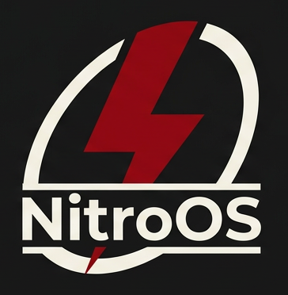

**NitroOS**🚀

*Descripció*: NitroOS és el nostra propi sistema operatiu que hem desenvolupat amb CosmOS. Uilitza el llenguatge de C#. Tenint com a objectiu del projecte construir un entorn de consola que ens pugui permetre gestionar fitxers, directoris i informació del sistema de manera bàsica.

*Noms dels membres del grup*:

Noha, Javier i Marc.

  

*Com funciona el nostra sistema*:

Aquí podem veure la pantalla d’inici de NitroOS executant-se dins d’una màquina virtual amb CosmOS.

A la part superior es veu la seqüència d’arrencada del sistema (Boot Sequence). Es mostra informació dels desenvolupadors del projecte i apareix el logotip de NitroOS en format ASCII art.

Finalment, es mostra un missatge de benvinguda i una breu instrucció perquè l’usuari entri a la shell. 

*Tecnologies utilitzades*:

Per a aquest servidor hem utilitzat llenguatge de programació en C#, com bé hem dit abans, el framework és de CosmOS, com a IDE tenim el Visual Studio Code 2022 i la plataforma que utilitcem és la .NET.

*Instal·lació i ús*:

[Més endavant]

*Estructura del projecte*:

[Captures + explicacions]

*Autors i contribucions*:

👩 Noha -> Revisió/Documentació.
👨 Javier -> Documentació 
👨 Marc -> Programació

*Llicència*:

Nosaltres disposem d'una llicència de codi obert per a aquest projecte.

*Roadmap o millores futures*:

·Llistar contingut

·Canviar directori

·Crear directori

·Eliminar directori

·Mostrar contingut fitxer

·Informació del sistema

·Mostrar ajuda

·Versió del SO

·Memòria disponible

·Temps de funcionament

·Netejar pantalla

·Escriure text

·Apagar/reiniciar

·sistema de comandes que permet a l’usuari introduir operacions matemàtiques bàsiques:

    Suma (+)
    
    Resta (-)
    
    Multiplicació (*)
    
    Divisió (/)
    
    Mòdul (%)
    
    Arrel quadrada (sqrt)
    
    
S'han implementat implementat les funcions per controlar l’estat del sistema:

- Apagat del sistema
  Cosmos.Sys.Deboot.ShutDown();
- Reinici del sistema
  Cosmos.Sys.Deboot.Reboot();

En el desenvolupament del sistema operatiu s’ha detectat que per defecte COSMOS OS utilitza un teclat americana. Per tal de millorar l’experiència d’usuari i adaptar-lo a la configuració local, s’ha implementat la possibilitat de configurar el layout del teclat.

Per establir el layout del teclat desitjat, s’ha afegit la següent línia de codi dins de la funció `BeforeRun()`:

Sys.KeyboardManager.SetKeyLayout(new Sys.ScanMaps.ESStandardLayout());

*Exemples d'una de les funcions creades*

#*Reiniciar el sistema*:

-----------------------------------------------------------------------------------------------------------------------------
using System.Diagnostics;

void HastaLuego()

{

    Console.WriteLine("Reiniciant el sistema...");
    Process.Start(new ProcessStartInfo("shutdown", "/r /t 0") 
    
    { 
        CreateNoWindow = true, 
        UseShellExecute = false 
    
    });
    
}
-----------------------------------------------------------------------------------------------------------------------------
Sistema de fitxers

Necessitarem un sistema de fitxers per a administrar fitxers, per fer aìxo declararem un objecte global del VFS: Sys.FileSystem.CosmosVFS fs = new Cosmos.System.FileSystem.CosmosVFS();
Ho registrarem al VFSManager dins de BeforeRun(): Sys.FileSystem.VFS.VFSManager.RegisterVFS(fs);
Afegirem la referència a System.IO per poder usar File i Directory.

Formatarem el disc, primer el buscarem amb VFSManager.GetDisks() i després formatarem el disc amb Disk.FormatDisk(int index, string format, bool quick = true) en FAT32

Comandes bàsiques:
Obtenir tots els fitxers d’un camí: var files_list = Directory.GetFiles(@"0:\\");.
Mostrar els noms amb un foreach (var file in files_list) { Console.WriteLine(file); }.
Obtenir també directoris amb: var directory_list = Directory.GetDirectories(@"0:\\"); i recórrer-los amb un altre foreach.

Llegir tots els fitxers d’un directori: primer var directory_list = Directory.GetFiles(@"0:\\");.
Per a cada fitxer, llegir i mostrar contingut dins d’un try-catch: var content = File.ReadAllText(file); i després escriure nom, mida i contingut.

Crear un fitxer nou: File.Create(@"0:\\testing.txt"); dins d’un try { ... } catch (Exception e) { ... }.
Crear un directori nou: Directory.Create(@"0:\\testdirectory\\"); també amb try-catch.
Esborrar fitxer i directori: File.Delete(@"0:\\testing.txt"); i Directory.Delete(@"0:\\testdirectory\\");.

Escriure text a un fitxer existent: File.WriteAllText(@"0:\\testing.txt", "Learning how to use VFS!"); dins d’un try-catch.
Llegir tot el text d’un fitxer concret: Console.WriteLine(File.ReadAllText(@"0:\\testing.txt")); amb try-catch.
Llegir totes les bytes d’un fitxer: Console.WriteLine(File.ReadAllBytes(@"0:\\testing.txt"));.
-----------------------------------------------------------------------------------------------------------------------------
Audio
Per a afegir audios de boot, command and command fail:
Necessitem 3 .wav
byte[] bootBytes = GetResourceBytes("boot.wav");
byte[] okBytes = GetResourceBytes("ok.wav");
byte[] errorBytes = GetResourceBytes("error.wav");

NECESSARI
using Cosmos.System.Audio;
using Cosmos.System.Audio.IO;

AudioMixer mixer;
AudioManager audioManager;
MemoryAudioStream bootStream, okStream, errorStream;

*pegar codigo*

L'àudio està implementat amb AudioMixer, MemoryAudioStream i AC97.
En VMware pot no funcionar correctament perquè el driver d'àudio compatible és AC97.
Per provar el so es recomana executar el sistema amb VirtualBox i configurar Audio Controller com ICH AC97.

-----------------------------------------------------------------------------------------------------------------------------
Hist: Funció que mostra les 5 últimes comandes fetes (s'emmagatzemen en una llista)
(codi)
Repetir + [num]: A partir de la llista anterior, ennumerada, es pot fer Repetir + un número per a repetir una commanda
(codi)

-----------------------------------------------------------------------------------------------------------------------------
*Enllaç explicatiu de les comandes implementades:*

> https://github.com/Eduardo2828/NitroOS/blob/main/ideas/comandos.txt
